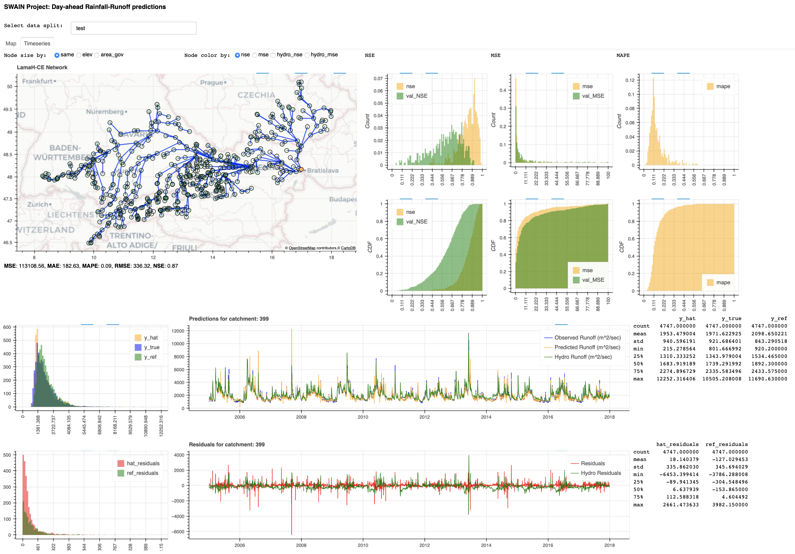

# SWAIN — a semi-distributed Rainfall-Runoff model

The following repo contains the code and tools to train several types of Rainfall-Runoff deep learning models based on graphs for the SWAIN project.

## Goal and data availability

The goal is to represent the entire watershed of a given river (mainly the Danube river network, using the data of the LamaH-CE dataset) as a Graph representing gauge station as Nodes, the river geography as weighted Edges, and exploit exogenous information (such as weather data and/or catchment/basin information) associated with each measuring station.

Gauge stations measure the flow rate ($m^3/s$) in various points of the river. Each one has a water basin associated, where weather measurements/forecasts have been collected. Moreover, there could be some basin-associated attributes, such as soil characteristics and environmental indicators.

The problem is thus centered on a one-step ahead non-linear regression task on historical time-series data, each timestamp being associated both to the measurements time-series (univariate, water flow) as well as the exougenous data time-series (multivariate).

Exogenous informations are provided in the form of heterogenous data; these influence the model prediction outcome, but viceversa do not get affected by the model itself. These are important to make sensible, accurate predictions w.r.t. real world conditions. In the case at hand, these pieces of data are weather predictions.

The following datasets have been implemented:

- Danube river, LamaH-CE dataset (basin delineation B, *Klingler et al.*)
- Ergene river, data from ITU / BOUN
- Kokemajoki river, data from SYKE (data on GDrive, to be ingested into MongoDB)

## Structure and Code base

This repo is based on the [tsl (Torch Spatiotemporal)](https://github.com/TorchSpatiotemporal/tsl) framework by [Andrea Cini](https://github.com/andreacini) and [Ivan Marisca](https://github.com/marshka).

The repository is structured as follows:

- [**dataset**](./dataset): dataset classes for different data corpora 
- [**models**](./models): PyTorch models
- [**scripts**](./scripts): running the model trainer, running the results plotter
- [**utils**](./utils): model evaluator, results plotter, and loss metrics
- [**tsl_config**](./tsl_config): example model training configurations
- [**default_config.yaml**](./default_config.yaml): TSL setup (Neptune token and account included)

The following models have been implemented:

- DCRNN (inspired by *Yaguang Li et al.*)
- GAT (inspired by *Veličković et al.*)
- GraphWaveNET (inspired by *Zonghan Wu et al.*)
- GatedGN (inspired by *Victor Garcia Satorras et al.*)

## How to

*(Every script must be executed from the root project folder)*

In order to run a particular model, execute the following command:

`python -m scripts.run_gnn --model-name=gat --config=gat.yaml`

Each experiment is automatically logged, unless specified otherwise, on Neptune. It keeps track of run configurations and some metrics. The Neptune account name and token are saved in the *default_config.yaml* file.

**The training outputs (model & predictions) are saved in the *logs folder* on the machine that runs the experiments! It is crucial to fetch them from the server to run the interactive visualization built upon Bokeh.**

In order to see results from a particular run, execute the following command, where *LMHRR-73* would be the run you intend to analyze:

`python -m scripts.run_plotter --dataset=lamah --exp-path=./logs/LMHRR-73`

## Training metrics
While the usual metrics for regression problems apply, such as MSE and MAE, hydrologists also use the [Nash-Sutcliffe efficiency coefficient](https://en.wikipedia.org/wiki/Nash–Sutcliffe_model_efficiency_coefficient) to train and evaluate models.

Unfortunately, the NSE (which effectively is the R2 coeffiencet) can't be used while training on a graph with multiple basins: each gauge stations measures the flow-rate in that point, which surely has a very different range than other parts of the river network. The effects are low training stability and good performance on very few nodes, bad otherwise (NSE < 0).

This is why *Kratzert et al.* introduced a basin-averaged metric:
$$
\mathrm{NSE}^*=\frac{1}{B} \sum_{b=1}^B \sum_{n=1}^N \frac{\left(\widehat{y}_n-y_n\right)^2}{(s(b)+\epsilon)^2}
$$

## Evaluation metrics and Results
Given that the goal of using a GNN is to simultaneously infer the flow-rate at multiple gauges in the river, to get a sense if the model is actually learning how water flows in the river, the evaluation of the model must be done on each separate catchment, and we used the standard NSE metrics to do so, plus the more traditional ones (MSE, MAE, MAPE, RMSE).

## Current status and Considerations
As it can be easily noted by running experiments, the GAT model outperforms the physical model predictions provided with LamaH-CE, and to the best of our knowledge, this is currently the first implementation of a GNN to predict the flow-rate in multiple gauges over a river network concurrently.

Currently, while not ideal given the ultimate goal of the project, the model operates on daily data instead of hourly data.

## References

[Yaguang Li et al.](https://arxiv.org/abs/1707.01926), *Diffusion Convolutional Recurrent Neural Network: Data-Driven Traffic Forecasting*, ICLR 2018

[Klingler et al.](https://essd.copernicus.org/articles/13/4529/2021/), *LamaH-CE: LArge-SaMple DAta for Hydrology and Environmental Sciences for Central Europe*, ESSD 2021

[Kratzert et al.](https://hess.copernicus.org/articles/23/5089/2019/), *Towards learning universal, regional, and local hydrological behaviors via machine learning applied to large-sample datasets*, HESS 2019

[Veličković et al.](https://arxiv.org/abs/1710.10903), *Graph Attention Networks*, ICLR 2018

[Victor Garcia Satorras et al.](https://openreview.net/forum?id=JpNH4CW_zl), *Multivariate Time Series Forecasting with Latent Graph Inference*, ICLR 2022

[Zonghan Wu et al.](https://arxiv.org/abs/1906.00121), *Graph WaveNet for Deep Spatial-Temporal Graph Modeling*, IJCAI 2019